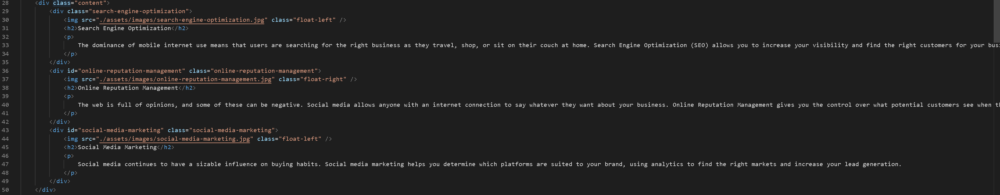
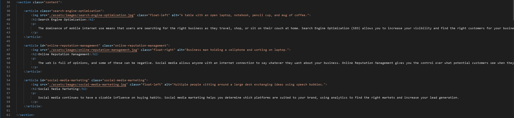

# Horiseon Site Refactor

## Description

For this project, I refactored the client's code with semantic HTML elements that follow a logical structure. Alt attributes have been added to image elements for greater accessibility. Additionally, I organized the CSS elements to match the flow of the HTML and added comments to make it easier to navigate.  

Examples can be seen below:

### Snippet of Original HTML Code

### Snippet of Refactored HTML Code

### Deployed Site
[deployed site](https://captaiiinsolo.github.io/refactor-site/)

## Installation

N/A

## Usage

- Users can browse the static webpage to get more information about what Horiseon can offer in terms of marketing, online reputation management, and search engine optimization. 

- Users can click on the links in the header that will direct to that specific section of the site.

## License

Please see the repository for license.